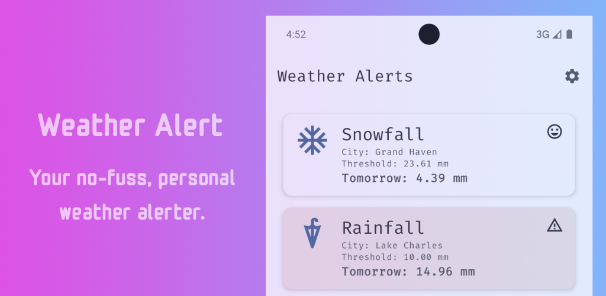

# Android - Weather Alert
A simple app to alert you about specific weather condition based on your configured threshold.

This helps you to prepare for certain condition, for example if there would be heavy snow ❄️ 
this will allow you charge your snow blower batteries, put car in the garage, and other related activities.

> _This app is a result from personal need to have focused alert compared to wonderful weather apps already available._

