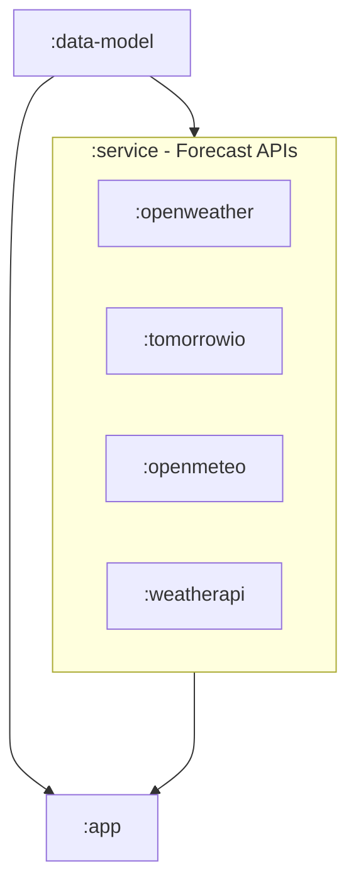

  

# Android - Weather Alert
A simple app to alert you about specific weather condition based on your configured threshold.

> [!NOTE]  
> _The app has been co-created with the help of GitHub Copilot, ChatGPT and Google Gemini._ 🤖

This app helps you to prepare for weather conditions like snow and rain, for example if there would be heavy snow ❄️ 
this will allow you charge your snow blower batteries, put car in the garage, and other related activities.

> _This app is a result from personal need to have focused alert compared to all existing apps available in the Play Store._

### **App Summary**  
**Set it and forget it — get alerted when it matters!**  

Weather Alert is a simple, no-frills app designed to notify you when specific weather conditions meet the thresholds you set. Whether it’s a snowy driveway or a rainy day, stay ahead with timely alerts that help you prepare with ease.  

🎨 Key App Features

🌨 **Custom Alerts for Specific Weather Conditions:**  
Set thresholds for snowfall or rainfall (e.g., 5cm snow, 10mm rain) and receive notifications only when they’re met.  

🌐 **Choose Your Data Source:**  
Pick between **OpenWeatherMap** and **Tomorrow.io** for reliable and accurate forecasts.  

🔑 **Add Your Own API Key:**  
Ensure uninterrupted service by using your own API key for weather data.  

⏰ **Set Your Alert Frequency:**  
Control how often the app checks for weather updates—every 6, 12, or 18 hours—so you get timely notifications without unnecessary checks.  

📲 **Rich Notifications:**  
Receive simple, clear notifications with all the details you need to take action.  

🛠 **Minimalist Interface:**  
Easily configure and view your alerts in a simple, intuitive tile-based design.  

**Why Choose Weather Alert?**  
- Focused on delivering only what you need: alerts that meet your criteria.  
- Lightweight and efficient, with no unnecessary extras.  
- Built for people who want actionable weather notifications, hassle-free.  

Try out **Weather Alert** today and let the app do the work for you!  

## Tech Stack 📱
Simple application generated from Android App template that uses:
* Jetpack Compose
* ⚡️ Circuit - UDF Architecture
* Jetpack libraries like - Room, Datastore, Material 3, and so on
* Dagger + Anvil
* ... and few more. See [`libs.versions.toml`](https://github.com/hossain-khan/android-weather-alert/blob/main/gradle/libs.versions.toml) to get more idea.

Here is simple diagram of Gradle modules for this app.

## 🤖 GitHub Copilot Configuration

This project is optimized for GitHub Copilot coding agent with comprehensive configuration:

### Copilot Instructions
- **[`.github/copilot-instructions.md`](.github/copilot-instructions.md)**: Detailed project context, architecture patterns, and coding guidelines
- Covers Android development best practices, testing strategies, and common code patterns
- Includes specific examples for Circuit UDF, Dagger DI, and Compose components

### Firewall Configuration
- **[`.github/copilot-firewall.yml`](.github/copilot-firewall.yml)**: Secure network access rules for build dependencies
- Allowlists essential domains: `dl.google.com`, Maven repositories, Gradle services
- Includes weather API endpoints and development tools while maintaining security

### Benefits for Developers
- **Enhanced Code Suggestions**: Context-aware recommendations based on project architecture
- **Consistent Patterns**: Enforced coding standards and architectural decisions
- **Secure Development**: Controlled network access for dependencies and APIs
- **Faster Onboarding**: Comprehensive documentation for new contributors

Learn more about [GitHub Copilot customization](https://docs.github.com/en/copilot/customizing-copilot) in the official documentation.
