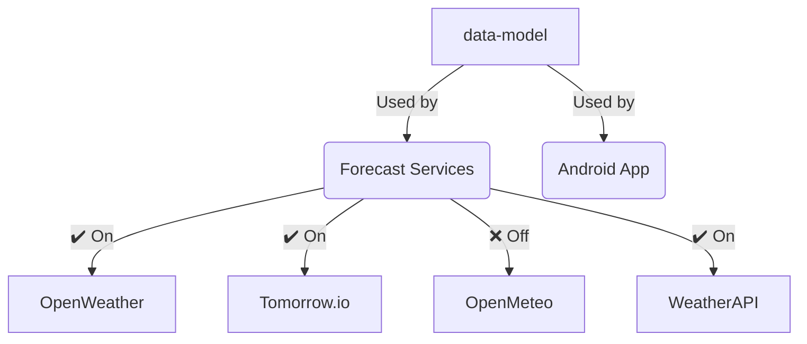

# Data Models
Contains common data models used by app and weather services.

```mermaid
flowchart TD
    DATA[data-model] -->|Used by| SERVICE(Forecast Services)
    DATA -->|Used by| C(Android App)
    SERVICE -->|✔️ On| OW[OpenWeather]
    SERVICE -->|✔️ On| TI[Tomorrow.io]
    SERVICE -->|❌ Off| OM[OpenMeteo]
    SERVICE -->|✔️ On| WA[WeatherAPI]
```