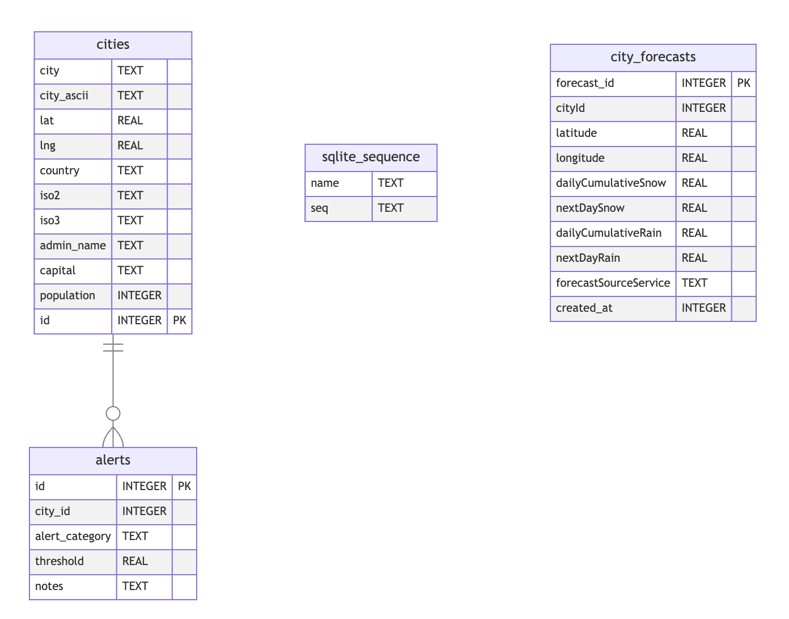

## City Data Merger
This project is a simple data merger that takes in data from three different sources and combines them into a single data source. 

### How to run
You need the base DB with world cities data first. And then run following kotlin app to combine the data from USA and Canada cities data sources.
- [CityDbBuilder.kt](src/main/kotlin/CityDbBuilder.kt)

The data sources are:
* 🌐 World Cities - https://simplemaps.com/data/world-cities
* 🇺🇸 USA Cities - https://simplemaps.com/data/us-cities
* 🇨🇦 Canada Cities - https://simplemaps.com/data/canada-cities

### Merge Result 📈
* Original world cities: **`47,868`**
* Merged cities records: **`76,984`**
* Difference: **`29,116`** new cities added (60.83% more than original)

## App Database Diagram
Here is a snapshot of app database schema 

## Sample CSV Data
Here is snapshot of CSV data from each source

### World Cities
| city      | city_ascii | lat     | lng      | country   | iso2 | iso3 | admin_name | capital | population | id         |
|-----------|------------|---------|----------|-----------|------|------|------------|---------|------------|------------|
| Tokyo     | Tokyo      | 35.6897 | 139.6922 | Japan     | JP   | JPN  | Tōkyō      | primary | 37732000   | 1392685764 |
| Jakarta   | Jakarta    | -6.1750 | 106.8275 | Indonesia | ID   | IDN  | Jakarta    | primary | 33756000   | 1360771077 |
| Delhi     | Delhi      | 28.6100 | 77.2300  | India     | IN   | IND  | Delhi      | admin   | 32226000   | 1356872604 |
| Guangzhou | Guangzhou  | 23.1300 | 113.2600 | China     | CN   | CHN  | Guangdong  | admin   | 26940000   | 1156237133 |

### Canada Cities
| city      | city_ascii | province_id | province_name    | lat     | lng       | population | density | timezone          | ranking | postal              | id         |
|-----------|------------|-------------|------------------|---------|-----------|------------|---------|-------------------|---------|---------------------|------------|
| Toronto   | Toronto    | ON          | Ontario          | 43.7417 | -79.3733  | 5647656    | 4427.8  | America/Toronto   | 1       | M5T M5V ... M8V M8W | 1124279679 |
| Montréal  | Montreal   | QC          | Quebec           | 45.5089 | -73.5617  | 3675219    | 4833.5  | America/Toronto   | 1       | H1X H1Y ... H9K H9C | 1124586170 |
| Vancouver | Vancouver  | BC          | British Columbia | 49.2500 | -123.1000 | 2426160    | 5749.9  | America/Vancouver | 1       | V6Z V6S ... V5X V5Y | 1124825478 |

### USA Cities
| city        | city_ascii  | state_id | state_name | county_fips | county_name | lat     | lng       | population | density | source | military | incorporated | timezone            | ranking | zips                        | id         |
|-------------|-------------|----------|------------|-------------|-------------|---------|-----------|------------|---------|--------|----------|--------------|---------------------|---------|-----------------------------|------------|
| New York    | New York    | NY       | New York   | 36081       | Queens      | 40.6943 | -73.9249  | 18908608   | 11080.3 | shape  | FALSE    | TRUE         | America/New_York    | 1       | 11229 11228 ... 11690 11695 | 1840034016 |
| Los Angeles | Los Angeles | CA       | California | 06037       | Los Angeles | 34.1141 | -118.4068 | 11922389   | 3184.7  | shape  | FALSE    | TRUE         | America/Los_Angeles | 1       | 91367 90291 ... 91617 91618 | 1840020491 |
| Chicago     | Chicago     | IL       | Illinois   | 17031       | Cook        | 41.8375 | -87.6866  | 8497759    | 4614.5  | shape  | FALSE    | TRUE         | America/Chicago     | 1       | 60018 60649 ... 60696 60699 | 1840000494 |
| Miami       | Miami       | FL       | Florida    | 12086       | Miami-Dade  | 25.7840 | -80.2101  | 6080145    | 4758.9  | shape  | FALSE    | TRUE         | America/New_York    | 1       | 33128 33129 ... 33255 33299 | 1840015149 |

